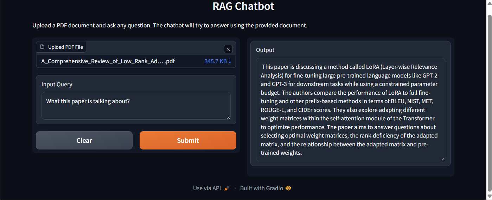

# 🧠 AI Document QA with Watson Embeddings + Chroma + Gradio

This project demonstrates a full pipeline to build a **Question Answering (QA)** system over your documents using:

- 📄 Document Loader
- ✂️ Text Splitter
- 🧬 WatsonX Embeddings
- 🗃️ Chroma Vector Store
- 🔁 Retriever
- 💬 QA Chain
- 🌐 Gradio Web Interface

---

## 📁 1. Document Loader

 load `.pdf`, `.txt`, or `.docx` files into memory using `LangChain` document loaders.

```python
from langchain.document_loaders import PyPDFLoader

loader = PyPDFLoader("files/sample.pdf")
documents = loader.load()
```

## 2. Text Splitter

 split the documents into smaller chunks so they can be embedded efficiently.

```
from langchain.text_splitter import RecursiveCharacterTextSplitter

splitter = RecursiveCharacterTextSplitter(chunk_size=500, chunk_overlap=100)
chunks = splitter.split_documents(documents)
```

## 3. WatsonX Embeddings

 use IBM WatsonX's embedding model to convert text chunks into numerical vectors.
```
from langchain.embeddings import WatsonxEmbeddings

embeddings = WatsonxEmbeddings(
    model_id="watsonx-embedding-model-id", 
    api_key="your_api_key"
)
```


## 4. Chroma Vector Store

 store and index the embeddings using ChromaDB, a fast and local vector database.

## 5. Retriever Setup

 use the Chroma vector store as a retriever to fetch relevant chunks given a user question.

## 6. QA Chain with LLM

Use a language model (e.g., WatsonX, OpenAI) to generate answers from the retrieved documents.

## 7. Gradio Interface

 create a simple web app for users to upload documents and ask questions via Gradio.


## ✅ How to Run

Clone the repo

Install dependencies

Add your WatsonX API keys

Run:


## 📦 Dependencies

langchain

chromadb

gradio

openai (or watsonx)

tiktoken, pdfminer, etc.